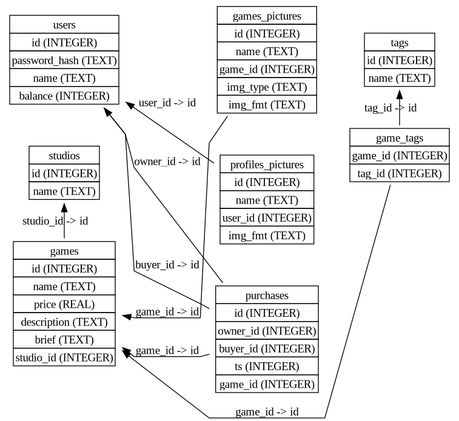
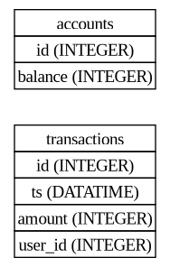

# Database Management Systems course project

## Project Theme : Online service for digital distribution of computer games and programs

### Project Description

#### TODO: FOR_THE_FUTURE

#### Generate test data

##### Environment set

###### You need to set environment variables into .env file like this

```
STORE_DB_NAME=store-db
STORE_DB_PSWD=store-pswd
STORE_DB_USER=store-user

BANK_DB_NAME=bank-db
BANK_DB_PSWD=bank-store
BANK_DB_USER=bank-user

DB_PORT=51488
```

##### Requierements for generator:

- python3
- python-pillow

##### To generate random test data use(modify before running constants in deGenerator.py file):

```
python3 deGenerator.py
```

#### Current architecture





#### About bank-service api

##### How to get user balance ( example )

```
curl --insecure -X GET -H 'Content-Type: application/json' -u "seregga:seregga" "https://127.0.0.1:5001/api/balance"
```

##### How to add account in our great bank ( example )

```
curl --insecure -X POST -H 'Content-Type: application/json' -d '{"uuid" : "test", "password" : "test"}' "https://127.0.0.1:5001/api/add-account"
```

##### How to delete bank account ( example )

```
curl --insecure -X POST -H 'Content-Type: application/json' -u "test:test" "https://127.0.0.1:5001/api/delete-account"
```

##### How to transfer money from one account to another ( example )

```
curl --insecure -X POST -H 'Content-Type: application/json' -u "test:test" -d '{"uuid_to" : "seregga", "amount" : 500 }' "https://127.0.0.1:5001/api/transfer"
```

##### Return codes for bank api service

- 401 -- authorization failed
- 402 -- wrong requested data
- 404 -- wrong request

### Development Stack : Docker, Python(backend + frontend), sqlite3

### Requirements list for running services on the local server :

- docker
- docker-compose
- openssl ( for certificates )
- curl ( for interaction with bank service )

## The composition of our team:

- Gubanov Peter (@gubanovpm)
- Khrol Ivan (@ent1r)
- Potapova Anna (@ann37)
